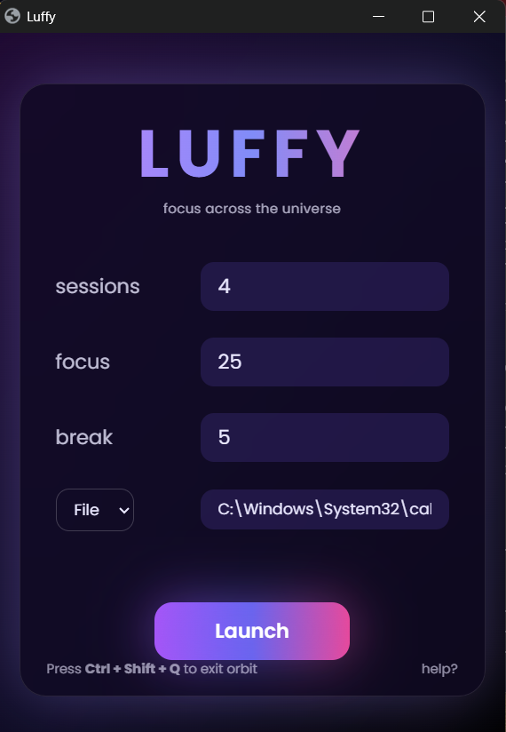

# Luffy
<div align="center">
  


# Luffy

A strict Pomodoro-based focus application that **forces productivity** by preventing distractions like tab switching, key combos, and mouse escapes.

## ✨️ DOWNLOAD for Windows
(Coming Soon)

</div>

---

## Features

- **Customizable Pomodoro Sessions**  
  Set the number of sessions, focus duration, and break duration.

- **Strict Distraction Blocking**
  - Blocks system key combinations (Windows key, Alt+Tab, etc.).
  - Prevents mouse movement to screen edges.

- **Fullscreen Enforcement**  
  Automatically forces fullscreen mode on the selected focus website.

- **Strict & Normal Modes**
  - **Normal Mode**: Safe exit using `Ctrl + Shift + Q`
  - **Strict Mode**: No escape until the session ends

- **Simple Desktop UI**  
  Built with HTML, JavaScript, and Tailwind CSS using Flask.

---

## Comparison

| Feature                         | Luffy | Freedom | RescueTime | Cold Turkey | Standard Pomodoro Timers |
|---------------------------------|-------|---------|------------|-------------|--------------------------|
| Website Blocking                | ✅    | ✅      | ✅         | ✅          | ❌                       |
| Fullscreen Enforcement          | ✅    | ❌      | ❌         | ❌          | ❌                       |
| Key Combination Blocking        | ✅    | ❌      | ❌         | ✅          | ❌                       |
| Mouse Movement Restriction      | ✅    | ❌      | ❌         | ❌          | ❌                       |
| Customizable Sessions           | ✅    | ✅      | ✅         | ✅          | ✅                       |
| Local App (No Account Needed)   | ✅    | ❌      | ❌         | ✅          | Varies                   |
| **How to Use**                  | `cd Luffy`<br>`python webapp.py` | App UI | Auto-tracking | App UI | App UI |

---

## Tech Stack

- **Backend**: Python (Flask)
- **Frontend**: HTML, JavaScript, Tailwind CSS
- **Desktop GUI**: FlaskWebGUI
- **Dependency Management**: Poetry
- **Libraries**:
  - `pyautogui`
  - `keyboard`
  - `pygetwindow`
  - `winsound`

---

## Insights

1. **Multithreading**  
   Runs the Pomodoro timer and mouse boundary enforcement in parallel.

2. **Low-Level Input Blocking**  
   Uses the `keyboard` library to intercept and block system-level key combinations.

3. **Window Control**  
   Ensures focus stays locked on the selected website using `pygetwindow`.

4. **Web-Based Desktop UI**  
   Flask + FlaskWebGUI enables a lightweight desktop experience.

5. **Fast UI Development**  
   Tailwind CSS via CDN keeps the interface clean and responsive.

---

## Setup & Installation

1. Clone the repository:
   ```bash
   git clone https://github.com/yourusername/Luffy.git
   cd Luffy


